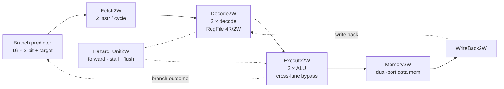

# Two-Way Superscalar RISC-V Processor with Dynamic Branch Prediction

A dual-issue, in-order, five-stage RISC-V (RV32I subset) processor in synthesizable SystemVerilog. It was the Computer Architecture module project of the Digital IC Design & Verification training at GIKI (USTP).

**Team:** Abdul Samad Abbasi · Govind · Shahzaib Hassan

## Highlights
- **Two instructions per cycle:** two lanes run through Fetch, Decode, Execute, Memory and Writeback, with a peak IPC of 2.
- **Dynamic branch predictor:** a 16-entry table with 2-bit saturating counters and stored targets, read in the Fetch stage.
- **Cross-lane bypass:** when the second instruction in a bundle depends on the first, the result is forwarded in the same cycle, so there is no stall.
- **Hazard unit:**
  - forwarding from the Memory and Writeback stages
  - a one-cycle stall on load-use
  - selective Decode/Execute flush on a misprediction
- **Shared multi-port register file:** 4 read ports and 2 write ports, plus a dual-port instruction memory and a dual-port data memory.

## Microarchitecture

| Module | Role |
|---|---|
| `Top2W` | Top-level integration |
| `Fetch2W` | Dual fetch, branch predictor, next-PC selection |
| `BranchPredictor` | 16-entry predictor (2-bit counter + target per entry) |
| `InstMem2W` | Dual-read-port instruction memory (holds the test program) |
| `Decode2W`, `ControlUnit` ×2, `ImmExtend` ×2 | Per-lane decode and immediate generation |
| `RegFile2W` | 4-read / 2-write register file |
| `Execute2W`, `ALU` ×2, `Mux3` | Dual ALU, forwarding muxes, cross-lane bypass |
| `Memory2W`, `DataMem2W` | Dual-port data memory |
| `WriteBack2W` | Per-lane result select |
| `Hazard_Unit2W` | Forwarding selects, stall and flush control |
| `StateReg`, `StateRegEn` | Pipeline register primitives |

## Hazard handling
| Situation | What happens |
|---|---|
| Two independent instructions | Both lanes advance together (IPC = 2) |
| Lane 1 uses lane 0's result in the same bundle | Same-cycle cross-lane bypass, 0 stall cycles |
| Load followed by a dependent instruction | 1-cycle stall of Fetch/Decode, then forward from Memory |
| Branch mispredicted | Wrong-path instructions in Decode/Execute are flushed; fetch restarts at the correct target in the next cycle |

Lane 1 never issues a branch or jump, so there is at most one control-flow instruction per bundle.

## Verification
`tb/tb_top.sv` is a self-checking testbench for `Top2W`. It runs the program in `InstMem2W` and checks:
- **Final register state:** `x1 = 10`, `x2 = 20`, `x3 = 30`, `x4 = 20` (loaded from memory), `x5 = 420` and `x6 = 400`.
- **Memory:** the stored word is in data memory.
- **x0:** it stays zero.
- **Dual-issue writeback:** at least one cycle writes back through both lanes.
- **Branch handling:** the predictor sees branches, and a flush happens after the first misprediction.

It also prints a cycle-by-cycle trace (instruction mnemonics per lane, stalls, flushes) and a summary. The summary covers dual-writeback cycles, stalls, flushes and prediction accuracy.

The test program runs `addi`, `add`, `sw`, `lw`, then a `beq` that is mispredicted the first time it is seen. Its fall-through instructions are flushed.

## Run (Vivado / xsim)
Add `rtl/*.sv` as design sources and `tb/tb_top.sv` as the simulation source, set `Top2W_tb` as the simulation top, then run behavioural simulation.

## Limitations / future work
- Only one control-flow instruction per fetch bundle.
- The slot-1 resynchronisation path (`ResyncD`) is defined but not yet driven.
- Issue is in-order; out-of-order issue with register renaming is a natural next step.
- The predictor is small and per-address; a larger BTB or global history would help real workloads.
- The design targets simulation and synthesis; FPGA bring-up is planned.

## Report
A full write-up of the design, including microarchitecture, per-stage RTL, worked cycle-level examples and verification, is in `docs/`.
